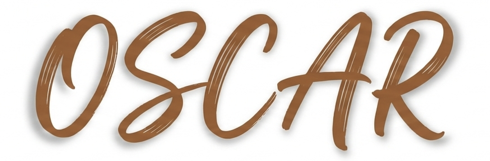

<div align="center">



<h2>OSCAR: Optical-aware Semantic Control for Aleatoric Refinement in Sar-to-Optical Translation</h2>

<div>
    <a href='https://www.linkedin.com/in/lee-hyunseo-8b0762362/' target='_blank'>Hyunseo Lee</a><sup>1</sup>&nbsp&nbsp&nbsp&nbsp;
    <a href='#' target='_blank'>Sang Min Kim</a><sup>1</sup>&nbsp&nbsp&nbsp&nbsp;
    <a href='#' target='_blank'>Ho kyung Shin</a><sup>1</sup>&nbsp&nbsp&nbsp&nbsp;
    <a href='#' target='_blank'>Taeheon Kim</a><sup>2</sup>&nbsp&nbsp&nbsp&nbsp;
    <a href='https://sites.google.com/view/prmi-knu/people?authuser=0' target='_blank'>Woo-Jeoung Nam</a><sup>1†</sup>
</div>
<br>
<div>
    <sup>†</sup>Co-corresponding authors</span>
</div>
<div>
    <sup>1</sup>Kyungpook National University</span>
</div>
<div>
    <sup>2</sup>Korea Aerospace Research Institute</span>
</div>

<div>
    <h4 align="center">
        <a href="https://eunoiahyunseo.github.io/OSCAR/" target='_blank'>
        
        </a>
        <a href="https://arxiv.org/abs/2601.06835" target='_blank'>
        
        </a>
        
    </h4>
</div>
</div>

---

<h4>
This repository is the official PyTorch implementation of "OSCAR: Optical-aware Semantic Control for Aleatoric Refinement in Sar-to-Optical Translation". OSCAR achieves state-of-the-art results on multiple datasets, outperforming the recent image-to-image translation methods and SAR-to-Optical image translation methods.
</h4>

---

## 📧 News
- **January 21, 2026:** Training scripts released for Optical-Aware SAR Encoder and Semantic-Grounded ControlNet
- **January 11, 2026:** This repository is created

## 📌 TODO
- [x] ~~Optical-Aware Encoder~~
- [x] ~~Semantic-Grounded ControlNet~~
- [x] ~~Dataset preprocess scripts~~
- [x] ~~Refactor code with Omegaconf and torchlightning~~
- [ ] Model zoo with drive


## 🔎 Overview Framework
### Optical-Aware SAR Encoder

### Semantic-Grounded ControlNet


---

## 🛠️ Installation

### Environment Setup

**1. Create a virtual environment with Python 3.11:**
```bash
conda create -n oscar python=3.11 -y
conda activate oscar
```

**2. Install dependencies:**
```bash
pip install -r requirements.txt
```

**3. Install configilm (local package):**
```bash
pip install -e ./configilm
```

**4. Fix diffusers compatibility issue:**

Navigate to the diffusers package in your environment and remove `cached_download` import:
```bash
cd $CONDA_PREFIX/lib/python3.11/site-packages/diffusers/utils
sed -i 's/from huggingface_hub import cached_download, /from huggingface_hub import /' dynamic_modules_utils.py
```

### Requirements
- Python 3.11
- PyTorch >= 2.0
- CUDA >= 11.8
- PyTorch Lightning >= 2.5.5
- OmegaConf >= 2.3.0

### Pre-trained Models

**1. Clone DINOv3 repository:**
```bash
git clone https://github.com/facebookresearch/dinov3.git
```

**2. Download pre-trained checkpoints:**

| Model | Description | Download |
|-------|-------------|----------|
| DINOv3 ViT-L/16 | Pretrained backbone (SAT-493M) | [dinov3-sat](https://github.com/facebookresearch/dinov3) |
| Stable Diffusion 2.1 | Base diffusion model | [HuggingFace](https://huggingface.co/stabilityai/stable-diffusion-2-1-base) |

---

## 📊 Supported Datasets

| Dataset | Classes | Description |
|---------|---------|-------------|
| **BENv2** (BigEarthNet v2) | 19 | Multi-label land cover classification with Sentinel-1/2 imagery |
| **SEN12MS** | 11 | Multi-temporal Sentinel-1/2 dataset with LCCS land use labels |

### BENv2 (BigEarthNet v2) Installation

1. Download BigEarthNet v2 (S1 + S2) from the official website:
   - https://bigearth.net/

2. Clone and use [rico-hdl](https://github.com/rsim-tu-berlin/rico-hdl) to encode the dataset into LMDB format:
   ```bash
   git clone https://github.com/rsim-tu-berlin/rico-hdl.git
   cd rico-hdl
   # Follow rico-hdl instructions to encode BigEarthNet v2
   ```

### SEN12MS Installation

1. Follow the official instructions to download the dataset:
   - https://github.com/schmitt-muc/SEN12MS

2. Create subset for training:
   ```bash
   python ./tools/sen12ms_make_subset.py
   ```

---

## 🚀 Training Guide

OSCAR training consists of two main components:
1. **Optical-Aware SAR Encoder** - DINOv3 with knowledge distillation (`dino_final.py`)
2. **Semantic-Grounded ControlNet** - Diffusion model for SAR-to-Optical translation (`train_controlnet.py`)

---

## 1️⃣ Optical-Aware SAR Encoder Training

The Optical-Aware SAR Encoder uses a 2-stage training process with DINOv3 and LoRA:

| Stage | Description | Input | Output |
|-------|-------------|-------|--------|
| **Stage 0** | Train optical baseline (Teacher) | Optical images | Optical encoder checkpoint |
| **Stage 1** | Train SAR with knowledge distillation (Student) | SAR images + Teacher | SAR encoder checkpoint |

### BENv2 Dataset

#### Stage 0: Optical Baseline (Teacher)

```bash
python scripts/train.py +experiment=stage0_benv2
```

#### Stage 1: SAR with Knowledge Distillation (Student)

```bash
python scripts/train.py +experiment=stage1_benv2 \
    distillation.teacher_checkpoint=./checkpoints/benv2/stage0_opt/last.ckpt
```

### SEN12MS Dataset

#### Stage 0: Optical Baseline (Teacher)

```bash
python scripts/train.py +experiment=stage0_sen12ms
```

#### Stage 1: SAR with Knowledge Distillation (Student)

```bash
python scripts/train.py +experiment=stage1_sen12ms \
    distillation.teacher_checkpoint=./checkpoints/sen12ms/stage0_opt/last.ckpt
```

### Config Overrides for `scripts/train.py`

| Override | Description | Example |
|----------|-------------|---------|
| `training.num_epochs` | Number of training epochs | `training.num_epochs=200` |
| `training.optimizer.lr_base` | Learning rate for LoRA and classifier | `training.optimizer.lr_base=5e-5` |
| `training.batch_size` | Batch size per GPU | `training.batch_size=64` |
| `trainer.devices` | Number of GPUs | `trainer.devices=4` |
| `model.lora.rank` | LoRA rank | `model.lora.rank=16` |
| `model.lora.alpha` | LoRA alpha | `model.lora.alpha=32` |
| `debug.fast_dev_run` | Quick debug run | `debug.fast_dev_run=true` |

---

## 2️⃣ Semantic-Grounded ControlNet Training

The Semantic-Grounded ControlNet uses Stable Diffusion 2.1 with ControlNet for SAR-to-Optical image synthesis.

### BENv2 Dataset

```bash
python scripts/train_controlnet.py +experiment=benv2
```

### SEN12MS Dataset

```bash
python scripts/train_controlnet.py +experiment=sen12ms
```

### Config Overrides for `scripts/train_controlnet.py`

| Override | Description | Example |
|----------|-------------|---------|
| `training.optimizer.lr` | Learning rate | `training.optimizer.lr=1e-5` |
| `training.batch_size` | Batch size per GPU | `training.batch_size=16` |
| `training.gradient_accumulation_steps` | Gradient accumulation steps | `training.gradient_accumulation_steps=8` |
| `training.max_train_steps` | Maximum training steps | `training.max_train_steps=200000` |
| `trainer.devices` | Number of GPUs | `trainer.devices=4` |
| `trainer.precision` | Mixed precision: `32`, `16-mixed`, `bf16-mixed` | `trainer.precision=bf16-mixed` |
| `debug.fast_dev_run` | Quick debug run | `debug.fast_dev_run=true` |

### Resume Training

To resume from a checkpoint:

```bash
python scripts/train_controlnet.py +experiment=benv2 \
    checkpoint.resume_path=./checkpoints/controlnet/benv2/last.ckpt
```

---

## 📁 Project Structure

```
OSCAR/
├── scripts/
│   ├── train.py                    # DINO KD training (Hydra)
│   ├── train_controlnet.py         # ControlNet training (Hydra)
│   └── test_controlnet.py          # Evaluation (Hydra)
├── configs/
│   ├── default.yaml                # DINO KD default config
│   ├── experiment/
│   │   ├── stage0_benv2.yaml       # Stage 0 optical baseline (BENv2)
│   │   ├── stage1_benv2.yaml       # Stage 1 SAR+KD (BENv2)
│   │   ├── stage0_sen12ms.yaml     # Stage 0 optical baseline (SEN12MS)
│   │   └── stage1_sen12ms.yaml     # Stage 1 SAR+KD (SEN12MS)
│   └── controlnet/
│       ├── default.yaml            # ControlNet default config
│       └── experiment/
│           ├── benv2.yaml          # ControlNet BENv2 experiment
│           └── sen12ms.yaml        # ControlNet SEN12MS experiment
├── src/
│   ├── datamodules/                # PyTorch Lightning DataModules
│   ├── modules/                    # PyTorch Lightning Modules
│   ├── models/                     # Model architectures
│   ├── losses/                     # Loss functions
│   └── callbacks/                  # Training callbacks
├── models/
│   ├── controlnet.py               # ControlNet architecture
│   ├── unet_2d_condition.py        # UNet with image cross-attention
│   └── unet_2d_blocks.py           # UNet building blocks
├── pipelines/
│   └── pipeline_seesr.py           # SeeSR inference pipeline
├── utils/
│   ├── transforms.py               # Data transforms for SAR/Optical
│   ├── prompts.py                  # Class prompts and prompt generation
│   ├── metrics.py                  # Image quality metrics (QNR, SAM, SCC, RMSE)
│   └── visualization.py            # Visualization utilities
└── stable-diffusion-2-1-base/      # Stable Diffusion weights
```

---

## 🔬 Evaluation

The unified `scripts/test_controlnet.py` script supports both BENv2 and SEN12MS datasets.

### BENv2 Dataset

```bash
python scripts/test_controlnet.py +experiment=benv2 \
    checkpoint.path=./checkpoints/controlnet/benv2/last.ckpt
```

### SEN12MS Dataset

```bash
python scripts/test_controlnet.py +experiment=sen12ms \
    checkpoint.path=./checkpoints/controlnet/sen12ms/last.ckpt
```

### Config Overrides for `scripts/test_controlnet.py`

| Override | Description | Example |
|----------|-------------|---------|
| `checkpoint.path` | Path to trained ControlNet checkpoint | `checkpoint.path=./checkpoints/controlnet/benv2/last.ckpt` |
| `validation.num_samples` | Number of samples to evaluate | `validation.num_samples=1000` |
| `validation.batch_size` | Evaluation batch size | `validation.batch_size=32` |
| `validation.inference_steps` | Diffusion inference steps | `validation.inference_steps=50` |
| `validation.guidance_scale` | Classifier-free guidance scale | `validation.guidance_scale=7.5` |
| `output_dir` | Output directory for results | `output_dir=./validation_results/benv2` |

### Evaluation Metrics

The evaluation script computes the following metrics:

**Perceptual Metrics:**
- PSNR (Peak Signal-to-Noise Ratio)
- SSIM (Structural Similarity Index)
- LPIPS (Learned Perceptual Image Patch Similarity)
- DISTS (Deep Image Structure and Texture Similarity)

**Remote Sensing Metrics:**
- QNR (Quality with No Reference)
- SAM (Spectral Angle Mapper)
- SCC (Spatial Correlation Coefficient)
- RMSE (Root Mean Square Error)

**Generative Metrics:**
- FID (Fréchet Inception Distance)
- KID (Kernel Inception Distance)
- ISC (Inception Score)

---

## 📈 Results

Please visit our [project page](https://eunoiahyunseo.github.io/OSCAR/) for more experimental results.
---

## 📝 Citation

If you find this work useful, please cite our paper:

```bibtex
@article{lee2026oscar,
  title={OSCAR: Optical-aware Semantic Control for Aleatoric Refinement in SAR-to-Optical Translation},
  author={Lee, Hyunseo and Kim, Sang Min and Shin, Ho kyung and Kim, Taeheon and Nam, Woo-Jeoung},
  journal={arXiv preprint arXiv:2601.06835},
  year={2026}
}
```

---

## 📜 License

The source codes including the checkpoint can be freely used for research and education only. Any commercial use should get formal permission from the principal investigator (Prof. Woo-Jeoung Nam, nwj0612@knu.ac.kr) or main author (Hyunseo Lee, heart2002101@knu.ac.kr).

---

## 🙏 Acknowledgements

This project builds upon the following works:`
- [DINOv3](https://github.com/facebookresearch/dinov3) - Vision Transformer backbone
- [Stable Diffusion](https://github.com/Stability-AI/stablediffusion) - Diffusion model
- [ControlNet](https://github.com/lllyasviel/ControlNet) - Conditional control for diffusion models


## Star History

[](https://www.star-history.com/#eunoiahyunseo/OSCAR&type=date&legend=top-left)
